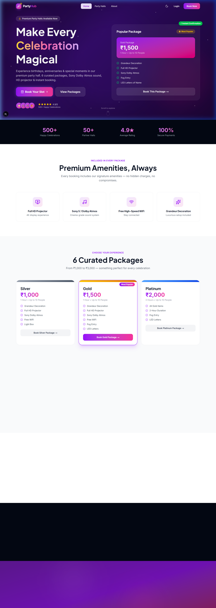
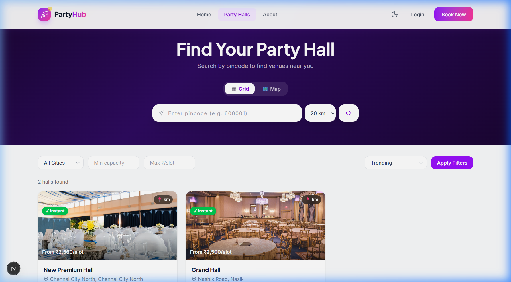
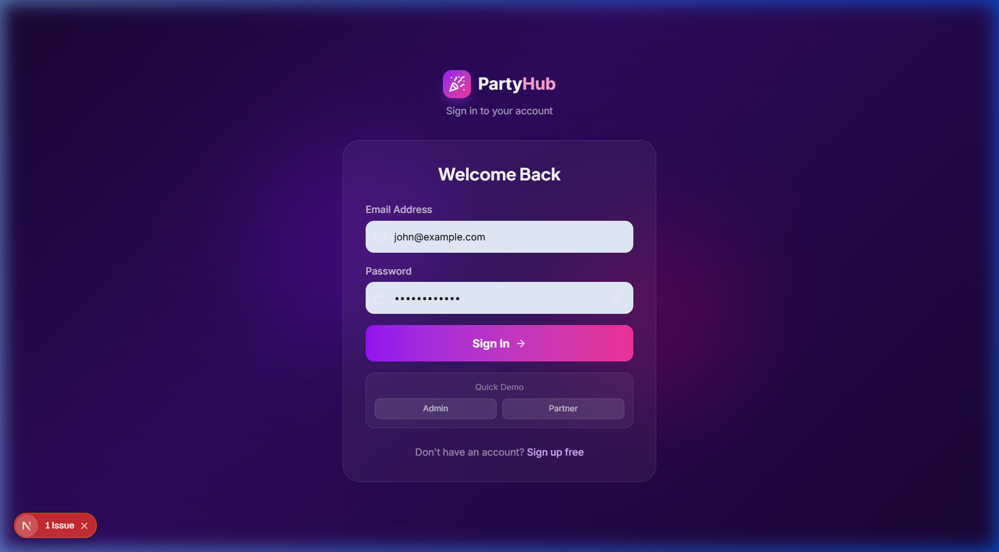

# PartyHub — Party Hall Booking Platform


A full-stack SaaS platform for discovering and booking party halls in India. Customers can browse verified venues, pick a package, and confirm a booking in under 2 minutes. Venue owners get a proper dashboard to manage everything — slots, bookings, analytics, and walk-in customers.

> **Why I built this:** Party hall booking in India is still mostly done over WhatsApp and phone calls. I wanted to fix that — one city at a time.

---

## Features

### For Customers
- Browse and filter halls by city, capacity, and price
- Real-time slot availability — WebSocket-powered with a 10-minute lock during checkout
- 6 curated packages from ₹1,000 to ₹3,000 per slot
- Add-on services: photography, fog machine entry, cake, decorations, etc.
- Digital QR code ticket sent on booking confirmation
- Leave reviews after a completed booking

### For Venue Partners
- Dashboard showing revenue, occupancy rate, and booking trends
- Multi-step hall creation with image upload and amenity selection
- Visual slot manager — add individual slots, bulk-generate recurring ones, or block dates
- Walk-in booking tool for cash/phone customers
- QR scanner for customer check-in at the venue
- Subscription-gated access (free trial → paid plans)

### For Admins
- Platform-wide stats: total bookings, revenue, new signups
- Approve or reject hall submissions before they go live
- Moderate customer reviews
- Manage subscription plans and per-partner limits

---

## Tech Stack

| Layer | Technology |
|---|---|
| **Frontend** | Next.js 16 (App Router), React 19, TypeScript |
| **Styling** | Tailwind CSS 4, Framer Motion, MUI v7 |
| **Backend** | Django 5.2, Django REST Framework |
| **Real-time** | Django Channels 4 + Daphne (WebSocket) |
| **Database** | PostgreSQL 16 |
| **Cache / Queue** | Redis 7 |
| **Auth** | JWT — access + refresh token rotation |
| **Payments** | Razorpay, Cashfree, or Dummy (dev mode) |
| **Maps** | MapLibre GL + OpenFreeMap — no API key needed |
| **Infra** | Docker Compose (local), Vercel (frontend), VPS (backend) |

---

## Getting Started

### Prerequisites
- [Docker Desktop](https://www.docker.com/products/docker-desktop/) — runs the backend stack
- [Node.js 20+](https://nodejs.org/)
- Git

### 1. Clone and configure

```bash
git clone https://github.com/YOUR_USERNAME/Party-Hall-SaaS-Model.git
cd Party-Hall-SaaS-Model

# Copy env files — defaults work out of the box for local dev
cp backend/.env.example backend/.env
cp party-hall-saas/.env.example party-hall-saas/.env.local
```

### 2. Start the backend

```bat
# Windows (PowerShell or CMD)
.\dev.bat

# Mac / Linux
sh dev.sh
```

This spins up PostgreSQL, Redis, and Django (with migrations applied) via Docker. First run takes about 30–60 seconds.

### 3. Start the frontend

```bash
cd party-hall-saas
npm install
npm run dev
```

Open **http://localhost:3000** in your browser.

### 4. Demo accounts

| Role | Email | Password |
|---|---|---|
| Admin | `admin@partyhub.in` | `Admin@123!` |
| Partner | `john@example.com` | `Partner@123!` |

> Payment gateway defaults to `dummy` mode — bookings complete instantly with no real money involved.

---

## Project Structure

```
Party-Hall-SaaS-Model/
├── backend/                  # Django backend
│   ├── accounts/             # Custom user model, JWT auth
│   ├── bookings/             # Slot locking, booking flow, QR check-in
│   ├── halls/                # Hall, Package, AddonService, HallImage models
│   ├── reviews/              # Reviews + admin moderation
│   ├── subscriptions/        # Partner subscription plans
│   ├── payments/             # Razorpay / Cashfree integration
│   ├── services/             # Shared utilities, price calculator
│   ├── config/               # Django settings, URL routing, ASGI config
│   ├── Dockerfile
│   └── requirements.txt
│
├── party-hall-saas/          # Next.js frontend
│   └── src/
│       ├── app/
│       │   ├── page.tsx      # Landing page
│       │   ├── halls/        # Browse halls, detail view, compare, map
│       │   ├── booking/      # Checkout wizard
│       │   ├── partner/      # Partner dashboard
│       │   ├── admin/        # Admin panel
│       │   └── account/      # Customer bookings and profile
│       ├── components/
│       │   ├── shared/       # Navbar, Footer, MapView
│       │   └── ui/           # Reusable design system components
│       ├── context/          # Auth context, Compare context
│       ├── hooks/            # useAuth, useWebSocket
│       └── lib/              # Axios client, helpers
│
├── docker-compose.yml        # Local dev stack
├── docker-compose.prod.yml   # Production stack
├── nginx/                    # Nginx reverse proxy config
├── dev.bat                   # Windows one-command dev startup
├── dev.sh                    # Mac/Linux one-command dev startup
└── README.md
```

---

## API Reference

Interactive Swagger docs available at **http://localhost:8000/api/docs/** when running locally.

| Group | Base Path |
|---|---|
| Auth | `/api/accounts/` |
| Halls | `/api/halls/` |
| Slots | `/api/slots/` |
| Bookings | `/api/bookings/` |
| Payments | `/api/payments/` |
| Reviews | `/api/reviews/` |
| Subscriptions | `/api/subscriptions/` |

**WebSocket** — real-time slot availability:
```
ws://localhost:8000/ws/slots/<hall_id>/
```

---

## Environment Variables

### Backend — `backend/.env`

```env
DEBUG=True
SECRET_KEY=your-secret-key-here
ALLOWED_HOSTS=*

# Database (matches docker-compose defaults)
DB_NAME=partyhub_db
DB_USER=partyhub
DB_PASSWORD=partyhub_pass
DB_HOST=db
DB_PORT=5432

# Redis
REDIS_URL=redis://redis:6379/0

# JWT token expiry (in minutes / days)
JWT_ACCESS_EXPIRY=60
JWT_REFRESH_EXPIRY=7

# Payment gateway: dummy | cashfree | razorpay
PAYMENT_GATEWAY=dummy

# CORS
CORS_ALLOWED_ORIGINS=http://localhost:3000
```

### Frontend — `party-hall-saas/.env.local`

```env
NEXT_PUBLIC_API_URL=http://localhost:8000/api
NEXT_PUBLIC_WS_URL=ws://localhost:8000
NEXT_PUBLIC_PAYMENT_GATEWAY=dummy
```

---

## Deployment

### Frontend (Vercel)

1. Push to GitHub
2. Import the repo in [Vercel](https://vercel.com) — set the root directory to `party-hall-saas`
3. Add these environment variables in the Vercel dashboard:
   - `NEXT_PUBLIC_API_URL` → `https://api.yourdomain.com/api`
   - `NEXT_PUBLIC_WS_URL` → `wss://api.yourdomain.com`
   - `NEXT_PUBLIC_PAYMENT_GATEWAY` → `razorpay`

### Backend

Deploy Django + PostgreSQL + Redis to any VPS — DigitalOcean, Railway, Render, or AWS EC2 all work fine. Use `docker-compose.prod.yml` with the Nginx config included.

---

## User Roles

| Role | Access |
|---|---|
| **Customer** | Browse halls, book slots, manage bookings, write reviews |
| **Partner** | Everything above + manage own halls, slots, packages, and analytics |
| **Admin** | Full platform access — approve halls, manage users, moderate reviews |

Partners can only see and modify their own data — enforced at the database query level, not just the UI.

---

## Screenshots

**Landing Page**


**Hall Listings**


**Login**


**Admin Dashboard**


---

## License

MIT — free to use, modify, and distribute.
